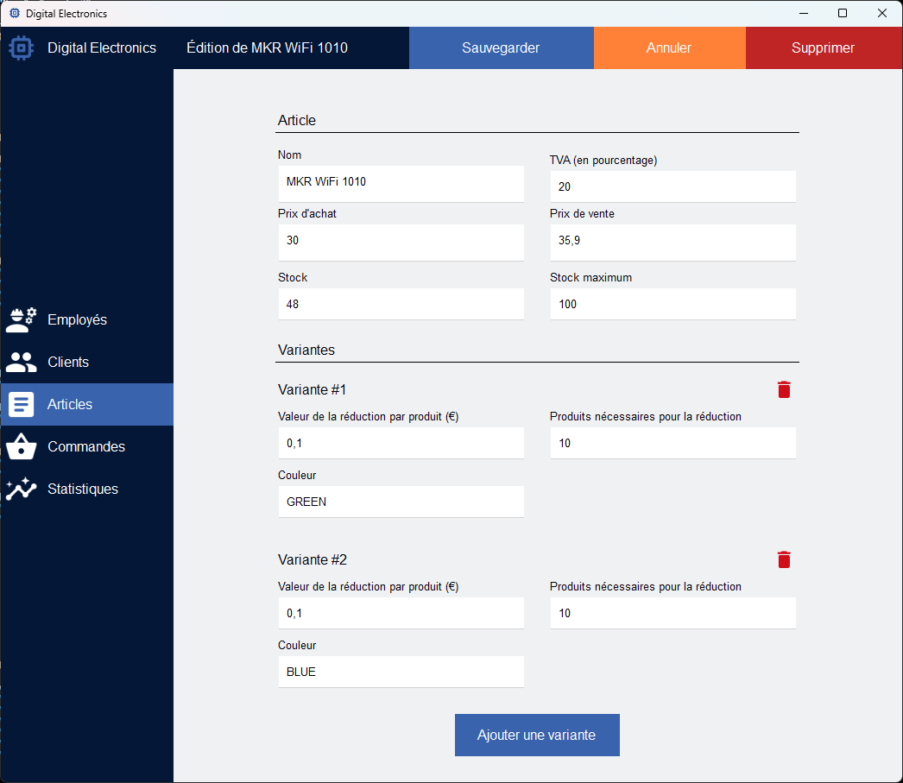

# Digital Electronics

Application graphique en C++/CLI connectée à une base de données Microsoft SQL Server qui prend en charge la gestion des
employés, des clients, des produits et des commandes.

## Composition du projet

Le projet est composé de 2 parties :

- La partie `Application` qui contient le point de la lancement de l'application, ainsi que la gestion des différentes
  vues
- La partie `Components` qui est une librairie interne. Elle contient les composants graphiques, les vues, les entités
  et les services

## Lancement du projet

Avant tout, il faut préparer une base de données Microsoft SQL Server et la provisionner avec le script `table.sql`.

Ensuite, afin de lancer le projet, il faut copier le fichier `Application/app.config.template`
dans `Application/app.config`. Suite à ça, indiquez-y les informations de connexion à la base de données.

Après, il suffit de lance le projet `Application` avec Visual Studio.

## Captures d'écran

